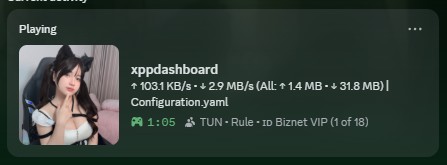
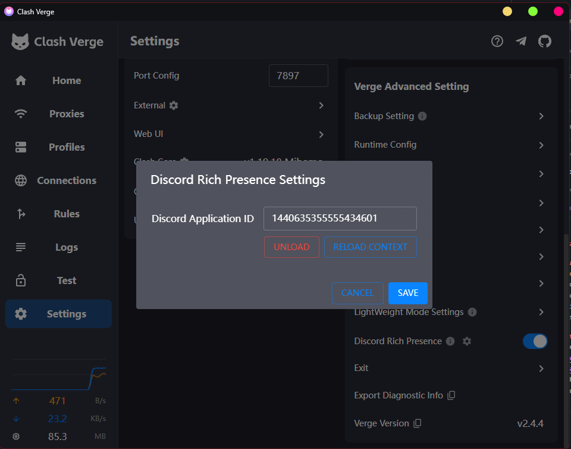

<h1 align="center">
  
  <br>
  Continuation of <a href="https://github.com/zzzgydi/clash-verge">Clash Verge</a>
  <br>
</h1>

<h3 align="center">
A Clash Meta GUI built with <a href="https://github.com/tauri-apps/tauri">Tauri</a>.
</h3>

## Preview

| Dark                                | Light                                 |
| ----------------------------------- | ------------------------------------- |
|  |  |

## Install

Visit the [Release page](https://github.com/clash-verge-rev/clash-verge-rev/releases) to download the installer that matches your platform, or build it yourself.<br>
We provide packages for Windows (x64/x86), Linux (x64/arm64), and macOS 10.15+ (Intel/Apple).

#### Choosing a Release Channel

| Channel     | Description                                                           | Link                                                                                   |
| :---------- | :-------------------------------------------------------------------- | :------------------------------------------------------------------------------------- |
| Stable      | Official builds with high reliability, ideal for daily use.           | [Release](https://github.com/clash-verge-rev/clash-verge-rev/releases)                 |
| Alpha (EOL) | Legacy builds used to validate the publish pipeline.                  | [Alpha](https://github.com/clash-verge-rev/clash-verge-rev/releases/tag/alpha)         |
| AutoBuild   | Rolling builds for testing and feedback. Expect experimental changes. | [AutoBuild](https://github.com/clash-verge-rev/clash-verge-rev/releases/tag/autobuild) |

#### Installation Guides & FAQ

Read the [project documentation](https://clash-verge-rev.github.io/) for install steps, troubleshooting, and frequently asked questions.


## Features

- Built on high-performance Rust with the Tauri 2 framework
- Ships with the embedded [Clash.Meta (mihomo)](https://github.com/MetaCubeX/mihomo) core and supports switching to the `Alpha` channel
- Clean, polished UI with theme color controls, proxy group/tray icons, and `CSS Injection`
- Enhanced profile management (Merge and Script helpers) with configuration syntax hints
- System proxy controls, guard mode, and `TUN` (virtual network adapter) support
- Visual editors for nodes and rules
- WebDAV-based backup and sync for configurations
- Discord Rich Presence (RPC) support




### FAQ

See the [FAQ page](https://clash-verge-rev.github.io/faq/windows.html) for platform-specific guidance.

### Donation

[Support Clash Verge Rev development](https://github.com/sponsors/clash-verge-rev)

## Development

See [CONTRIBUTING.md](./CONTRIBUTING.md) for detailed contribution guidelines.

After installing all **Tauri** prerequisites, run the development shell with:

```shell
pnpm i
pnpm run prebuild
pnpm dev
```

## Contributions

Issues and pull requests are welcome!

## Acknowledgement

Clash Verge Rev builds on or draws inspiration from these projects:

- [clash-verge-rev/clash-verge-rev](https://github.com/clash-verge-rev/clash-verge-rev): Continuation of Clash Verge.
- [zzzgydi/clash-verge](https://github.com/zzzgydi/clash-verge): A Tauri-based Clash GUI for Windows, macOS, and Linux.
- [tauri-apps/tauri](https://github.com/tauri-apps/tauri): Build smaller, faster, more secure desktop apps with a web frontend.
- [Dreamacro/clash](https://github.com/Dreamacro/clash): A rule-based tunnel written in Go.
- [MetaCubeX/mihomo](https://github.com/MetaCubeX/mihomo): A rule-based tunnel written in Go.
- [Fndroid/clash_for_windows_pkg](https://github.com/Fndroid/clash_for_windows_pkg): A Clash GUI for Windows and macOS.
- [vitejs/vite](https://github.com/vitejs/vite): Next-generation frontend tooling with blazing-fast DX.

## License

GPL-3.0 License. See the [license file](./LICENSE) for details.
